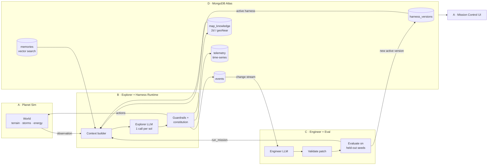

# Project Plan: Self-Healing Rover Harness

A rover agent whose harness repairs and improves itself, with no human in the loop. An **Explorer** agent drives a rover across a simulated planet. When the rover gets into trouble, an **Engineer** agent rewrites the Explorer's harness: its rules, guardrails, tool access and memory policy. A patch is kept only if it scores better on planets held back for testing.

> "Our rover is 20 light-minutes from the nearest engineer. When its agent fails, nobody can patch it. So the harness patches itself."

| Item | Detail |
| --- | --- |
| Lead theme | Statement One, Recursive Harnessing: the Engineer evolves rules, guardrails, tool access and context policy |
| Supporting theme | Statement Two, Long Horizon Engineering: memory across a mission, lessons carried between missions, scored on hard metrics |
| MongoDB role | Harness lineage, telemetry (time-series), incidents, vector memory, geospatial map knowledge; change streams trigger the Engineer |
| Deadline | Submission closes **5:00 PM**; we submit at **4:40 PM** |

The planet is the testing ground, not the product.

## The problem

Rovers are far enough away that every mistake costs days. When a rover hits a fault, it goes into safe mode and waits for Earth. The one-way light delay is 3–22 minutes, and it goes dark for about two weeks during solar conjunction. We simulate the real failure modes and let the harness learn to handle them itself.

| Real problem | Real example | In our sim | Fix we expect the Engineer to find |
| --- | --- | --- | --- |
| Soft sand | Spirit stuck for good in 2009 | `sand` tiles with hidden slip | Enable `probe_terrain`; add an `avoid_terrain` guardrail |
| Dust storms | Opportunity lost in 2018 | `tau` storms cut solar power | Enable `shelter`; add a `shelter_when_tau_above` guardrail |
| Wheel damage | Curiosity's wheels torn by sharp rocks | `rocks` wear down `wheel_health` | Lower `max_steps_per_move`; add a rule to avoid rocks |
| Long missions | Opportunity: planned for 90 sols, lasted about 15 years | Memory and mission summaries | Raise `memory_k`; turn on `summarize_every` |
| Signal vs noise | Chasing false anomalies wastes energy | About 30% of scan signals are false | Rule: scan twice before a detour |
| Light delay | Safe mode waits for Earth | No human in the loop at all | The whole Engineer loop |

## Architecture

### The core loop

1. The Explorer loads the **active** harness from `harness_versions`.
2. Each sol runs in six steps:
    1. Observe.
    2. Build the context: recent sols, memories from vector search, and nearby hazards from `$geoNear`, as the context policy says.
    3. Make one LLM call, which returns up to 5 actions.
    4. Check the actions against the guardrails and the constitution.
    5. The sim runs them.
    6. Log everything to Atlas.
3. When a major incident is inserted into `events`, a **change stream** wakes the Engineer.
4. The Engineer reads the incident, the sols before it (including the Explorer's reasoning), the harness, and past patches. It proposes a **typed patch**.
5. The patch is validated against the schema and the constitution. Then the old and new versions are **evaluated on held-out seeds 101–103**. The patch is accepted only if the score really improves.
6. An accepted patch becomes the new active version and writes a `lesson` memory. The next mission uses it.

Details: [CONTRACTS.md](CONTRACTS.md) holds every interface. [DEPENDENCIES.md](DEPENDENCIES.md) lists who waits on whom, and the stubs.

## Work split

| | Workstream | Owns | Brief |
| --- | --- | --- | --- |
| A | Planet Simulator + Mission Control UI | `sim/`, `web/` | [A-planet-sim.md](workstreams/A-planet-sim.md) |
| B | Explorer Agent + Harness Runtime | `explorer/`, `contracts/models.py` | [B-explorer-harness.md](workstreams/B-explorer-harness.md) |
| C | Engineer Agent + Evaluation | `engineer/`, `contracts/scoring.py`, `contracts/constitution.py` | [C-engineer-eval.md](workstreams/C-engineer-eval.md) |
| D | MongoDB Atlas + Demo | `db/`, `scripts/`, README | [D-atlas-demo.md](workstreams/D-atlas-demo.md) |

Each workstream codes against CONTRACTS.md with its own stubs, so nobody is blocked before the 3:15 checkpoint.

**Git:**
- Only commit inside the folders you own.
- Pull with rebase before every push (`git pull --rebase`), and push small commits often.
- Log changes to `contracts/` in DEPENDENCIES.md.

## Timeline

| Time | Milestone | Who |
| --- | --- | --- |
| 1:50–2:05 | Kickoff: assign A–D, read CONTRACTS.md and your brief, get sandbox Atlas access and API keys into `.env` | All |
| 2:15 | `contracts/models.py` pushed | B |
| 2:20 | `pyproject.toml`, `db/client.py`, `contracts/scoring.py`, `contracts/constitution.py` pushed | D, C |
| 2:30 | `fixtures/snapshot.json` pushed; harness v1 seeded in Atlas | A, D |
| **3:15** | **Checkpoint 1:** each module runs alone on stubs | All |
| 3:15–3:45 | Integration: real sim in B, real `run_mission` in C, real data in the UI | All |
| **3:45** | **Checkpoint 2:** one full loop, from incident to patch to evaluation to a new version visible in the UI | All |
| 3:50 | Start the pre-run evolution (6 generations) | C |
| **4:15** | **Feature freeze**: bug fixes only | All |
| 4:15–4:40 | Record the 1-minute video, finish the README, confirm the repo is public | D, with all |
| **4:40** | **Submit** (20-minute buffer) | D |
| 5:15 | Judging: about 3 minutes of live demo, then Q&A | Presenter |

## Demo script

**Live demo (3 minutes)**

| Time | Show | Say |
| --- | --- | --- |
| 0:00–0:20 | Planet view, seed 42 | The pitch line. Real rovers go into safe mode and wait days for Earth. |
| 0:20–0:50 | Harness v1 drives into sand and gets stuck; the incident appears in the feed | This incident was just written to Atlas, and a change stream woke the Engineer. |
| 0:50–1:30 | Engineer timeline: diagnosis, then patch ops (enable `probe_terrain`, add an `avoid_terrain` guardrail), then scores on seeds 101–103 | It is only kept because it beat the old version on planets it never trained on. |
| 1:30–2:00 | Harness Lab: lineage v1 → v6 with rising scores; one rejected patch that tried to delete the battery guardrail | It cannot game the score. The constitution and held-out evaluation stop it. |
| 2:00–2:30 | The evolved harness on seed 42: it probes, detours, shelters through the storm. Show a retrieved memory in its context | Lessons persist in vector memory across missions. |
| 2:30–3:00 | Atlas tab: collections, vector index, change stream | MongoDB is the rover's memory and the harness's version control. |

**Video (1 minute):** the same story with one incident, one patch, the lineage, and the evolved run. It must show only what we built today.

**Q&A answers:**
- *Why not just prompt it better?* Nobody can prompt a rover 20 light-minutes away. The patch ops, validation and evaluation are the product.
- *How do you know it improved?* By the held-out seeds, with scores on a fixed formula.
- *Could it cheat?* The constitution is immutable; see the rejected patch.

## Risks and open decisions

| Risk | Mitigation | Owner |
| --- | --- | --- |
| Integration slips past 3:45 | Contracts plus stubs; cut scope at each checkpoint rather than wait | All |
| LLM latency makes evaluation too slow | One call per sol; Haiku for the Explorer; parallel runs; cached baselines; 30-sol missions | B, C |
| Patches do not measurably help | A tunes seeds so v1's failures are fixable; fixed seeds and temperature 0 | A, C |
| Noisy scores | Same seeds for baseline and candidate; 5 seeds if needed | C |
| Project reads as a dashboard | UI panels explain agent actions; demo narrated around the Engineer | A, D |
| Not built on the sandbox cluster | D verifies at kickoff | D |

**Open decisions**

- [ ] Assign names to A, B, C and D
- [ ] Who presents at 5:15 and on September 30, if we are a finalist
- [ ] Confirm the LLM models: `claude-haiku-4-5-20251001` for the Explorer and `claude-sonnet-5` for the Engineer, or `claude-opus-5-5` if latency allows
- [ ] Choose the embedding model: Voyage AI, if a key is available from the hackathon resources
- [ ] Project name for the submission
